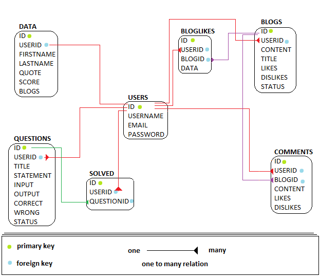

# opencodecompete

A web application where users can solve programming questions and also contribute their own questions.

## ARCHITECTURE


## Database schema




# How to setup on your own system:

## prerequisites

* Install Redis
* Install PostgreSQL
* Install Node

## Set up development environment 

* Clone the application on your local machine.

* Open terminal and navigate to `/frontend` folder and type the following command:
    ```
        npm install
    ```

* Now using the terminal, navigate to `/backend` folder and type the following command:
    ```
        npm install
    ```
* Create a .env file in backend folder with the following details:
    ```
    CORS_ORIGIN=http://localhost:3000
    PORT=5000
    SECRETKEY=    ( ENTER )
    DB_USERNAME=  ( ENTER )
    DB_PASSWORD=  ( ENTER )
    DB_HOST= localhost
    REDIS_url=http://localhost:6379
    ```

## Start application

* Make sure the postgres database is running 

* Start the redis server

* Open terminal and navigate to `/frontend` folder and type the following command to start the frontend server
    ```
    npm start
    ```

* Open another terminal and navigate to `/backend` folder and type the following command to start the backend server
    ```
    npm run dev
    ```


> For documentation about codebase, please refer to README under `/assets` folder.